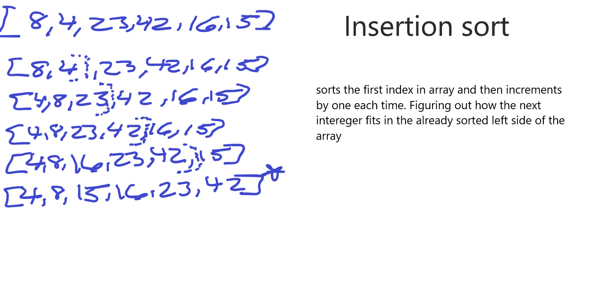

# Challenge Summary

Review the pseudocode below, then trace the algorithm by stepping through the process with the provided sample array. Document your explanation by creating a blog article that shows the step-by-step output after each iteration through some sort of visual.

## Challenge Description

Pseudocode
  InsertionSort(int[] arr)
  
    FOR i = 1 to arr.length
    
      int j <-- i - 1
      int temp <-- arr[i]
      
      WHILE j >= 0 AND temp < arr[j]
        arr[j + 1] <-- arr[j]
        j <-- j - 1
        
      arr[j + 1] <-- temp

## Approach & Efficiency

* Start by picking the second element in the array
* Now compare the second element with the one before it and swap if necessary
* Continue to the next element and if it is in the incorrect order, iterate through the sorted portion (i.e. the left side) to place the element in the correct place

## Solution
