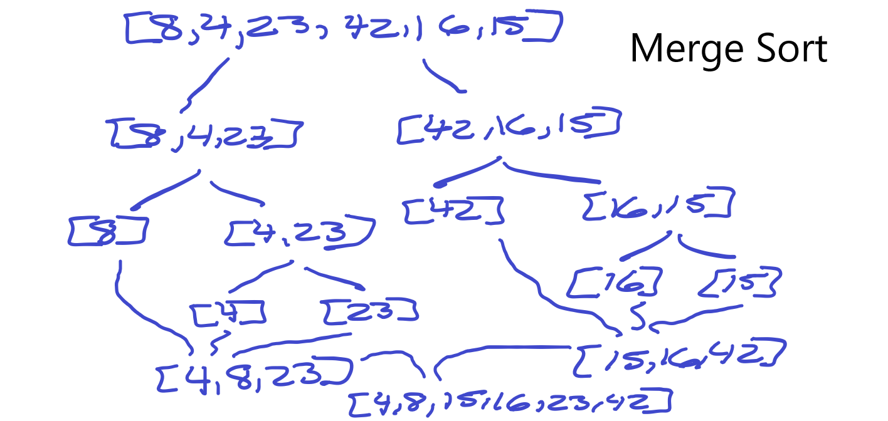

# Challenge Summary

Review the pseudocode below, then trace the algorithm by stepping through the process with the provided sample array. Document your explanation by creating a blog article that shows the step-by-step output after each iteration through some sort of visual.

## Challenge Description

ALGORITHM Mergesort(arr)
    DECLARE n <-- arr.length
           
    if n > 1
      DECLARE mid <-- n/2
      DECLARE left <-- arr[0...mid]
      DECLARE right <-- arr[mid...n]
      // sort the left side
      Mergesort(left)
      // sort the right side
      Mergesort(right)
      // merge the sorted left and right sides together
      Merge(left, right, arr)

ALGORITHM Merge(left, right, arr)
    DECLARE i <-- 0
    DECLARE j <-- 0
    DECLARE k <-- 0

    while i < left.length && j < right.length
        if left[i] <= right[j]
            arr[k] <-- left[i]
            i <-- i + 1
        else
            arr[k] <-- right[j]
            j <-- j + 1
            
        k <-- k + 1

    if i = left.length
       set remaining entries in arr to remaining values in right
    else
       set remaining entries in arr to remaining values in left

## Approach & Efficiency

* Create an empty array, take a look at the smallest values in each input array
* While there still values we haven't looked at...
    * If the value in the first array is smaller than the value in the second array, push the value in the first array into our results and move onto the next value in the first array
    * If the value in the first array is larger than the value in the second array, push the value in the second array intou our results and move onto the next value in the second array
    * Once we exhaust one array, push in all remaining values from the other array

## Solution
