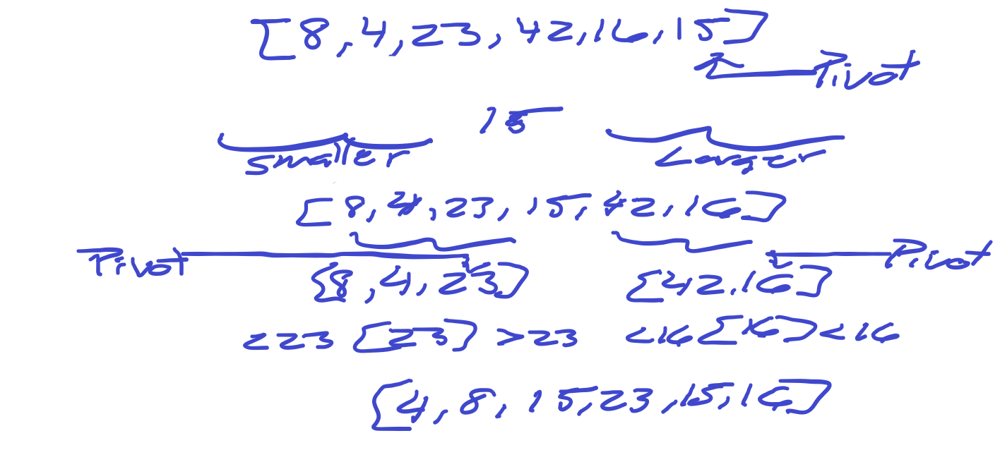

# Challenge Summary

### Partition
It should take an array, and a left index, and a right index. But left and right will have default values of 0 and the last index of the array. In return, it should rearrange so that the elements greater than (or equal to) the element at initial pivot index are to its right, and those less than that element are to its left.

### Quick Sort
It will take an array, a left index and right index. The left and right will have a default of 0 and the last index of the array.

* Call the pivot helper on the array
* When the helper returns the updated pivot index, recursively call the pivot helper on the subarray to the left of that index, and the subarray to the right of that index
* Base case occurs when there is a subarray with less than 2 elements

## Challenge Description

### Pseudo Code

ALGORITHM QuickSort(arr, left, right)
    if left < right
        // Partition the array by setting the position of the pivot value 
        DEFINE position <-- Partition(arr, left, right)
        // Sort the left
        QuickSort(arr, left, position - 1)
        // Sort the right
        QuickSort(arr, position + 1, right)

ALGORITHM Partition(arr, left, right)
    // set a pivot value as a point of reference
    DEFINE pivot <-- arr[right]
    // create a variable to track the largest index of numbers lower than the defined pivot
    DEFINE low <-- left - 1
    for i <- left to right do
        if arr[i] <= pivot
            low++
            Swap(arr, i, low)

     // place the value of the pivot location in the middle.
     // all numbers smaller than the pivot are on the left, larger on the right. 
     Swap(arr, right, low + 1)
    // return the pivot index point
     return low + 1

ALGORITHM Swap(arr, i, low)
    DEFINE temp;
    temp <-- arr[i]
    arr[i] <-- arr[low]
    arr[low] <-- temp

## Approach & Efficiency

The best case scenario is one in which the picot always ends up smack in the middle of the subarray after the partition. The worst case scenario is one in which the pivot always ends up on the side of the subarray instead of the middle. In a worst case scenarion quick sort has a efficienty of O(N^2)

## Solution
